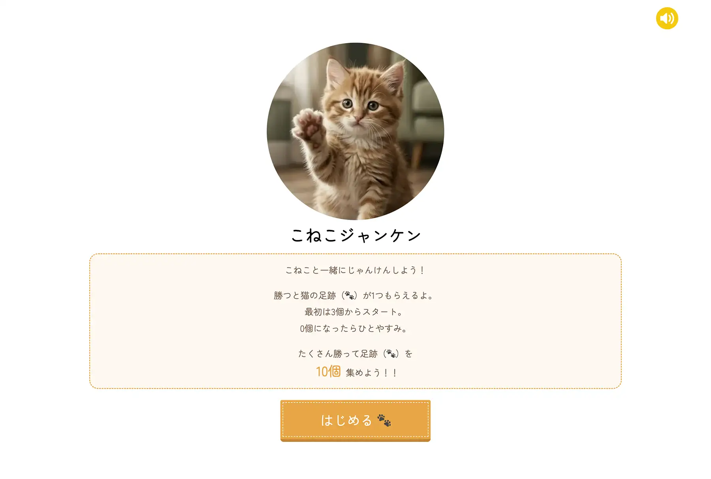

# ①課題名

こねこジャンケン

## ②課題内容（どんな作品か）

勝つと猫の足跡が1つもらえる。 
足跡を10個集めたら猫からプレゼントがもらえる。（猫缶、ちゅーる、ねこじゃらしからランダムで提供） 
プレゼントは2ターン目で使用可能。

## ③アプリのデプロイURL

https://wild-river.github.io/kadai01_janken/

## ④アプリのログイン用IDまたはPassword（ある場合）

- ID: 今回なし
- PW: 今回なし

## ⑤工夫した点・こだわった点

- PCでもスマホも楽しめるようにさまざまな画面幅に対応しています。
- 「ゲーム」としての楽しさやワクワク感が伝わるよう、ゲームの内容はもちろん、BGMやボタン操作時のサウンドにもこだわりました。

## ⑥難しかった点・次回トライしたいこと（又は機能）

- 表示、非表示の切り替えやタイミングの制御など、自分だけでは実装方法に行き詰まる場面も多く、AIに質問しながら内容を理解してコードを書き進めたため、多くの時間がかかりました。
- コード量が増えるにつれ、記述の順番や整理の仕方のルールをどのように決めればよいかが課題として残っています。

## ⑦フリー項目（感想、シェアしたいこと等なんでも）

「こねこ」に癒されてほしい！
